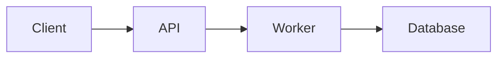

# 프로젝트 문서

이 디렉토리는 위성 이미지 분석 AI 추론 시스템의 모든 기술 문서를 포함합니다.

## 문서 목록

### 아키텍처 및 설계

#### [ARCHITECTURE.md](./ARCHITECTURE.md)
시스템 전체 아키텍처에 대한 상세 설명

**내용:**
- 시스템 구성도
- 컴포넌트 설명
- 데이터 플로우
- 네트워크 구성
- 스케일링 전략
- 보안 고려사항
- 성능 특성

**대상 독자:** 시스템 아키텍트, 개발자, DevOps 엔지니어

---

#### [UML_DIAGRAMS.md](./UML_DIAGRAMS.md)
시스템의 UML 다이어그램 모음

**내용:**
- 시퀀스 다이어그램
  - 추론 요청 플로우
  - 대시보드 실시간 업데이트
  - 데이터 시뮬레이터 플로우
- 클래스 다이어그램
  - Operation Server 구조
  - Analysis Worker 구조
  - 데이터 모델
- 컴포넌트 다이어그램
- 상태 다이어그램
- 배포 다이어그램
- 활동 다이어그램

**대상 독자:** 개발자, 시스템 아키텍트

---

### API 및 통합

#### [API_REFERENCE.md](./API_REFERENCE.md)
REST API 및 WebSocket API 전체 레퍼런스

**내용:**
- 추론 API
  - Submit Inference Job
  - Get Job Status
  - Get Inference Result
- 대시보드 API
  - Get Recent Results
  - Get Live Statistics
  - Get Model Comparison
  - Get Pattern Distribution
- WebSocket API
  - Job Status WebSocket
  - Dashboard WebSocket
- 에러 코드 및 처리
- 데이터 스키마
- Best Practices

**대상 독자:** API 사용자, 프론트엔드 개발자, 통합 개발자

---

### 배포 및 운영

#### [DEPLOYMENT.md](./DEPLOYMENT.md)
시스템 배포 가이드

**내용:**
- 사전 요구사항
- Docker Compose 설정
- 환경 변수 구성
- 서비스 시작/중지
- 트러블슈팅

**대상 독자:** DevOps 엔지니어, 시스템 관리자

---

#### [QUICKSTART.md](./QUICKSTART.md)
빠른 시작 가이드

**내용:**
- 5분 만에 시작하기
- 기본 사용 예제
- 주요 명령어

**대상 독자:** 처음 시작하는 사용자

---

### 기능 및 도구

#### [MONITORING_UI.md](./MONITORING_UI.md)
모니터링 UI 접속 및 사용 가이드

**내용:**
- Kafka UI (포트 8080)
- Redis Insight (포트 8001)
- AI Dashboard (포트 80)
- Celery Flower (포트 5555)
- 접속 방법 및 기능 설명

**대상 독자:** 운영자, 개발자, 모니터링 담당자

---

#### [SIMULATOR_README.md](./SIMULATOR_README.md)
데이터 시뮬레이터 사용 가이드

**내용:**
- 시뮬레이터 설치 및 실행
- 명령줄 옵션
- 데이터 패턴 유형
- 사용 예제

**대상 독자:** 테스트 담당자, 개발자

---

### 테스트 및 검증

#### [TEST_RESULTS.md](./TEST_RESULTS.md)
시스템 테스트 결과 보고서

**내용:**
- API 테스트 결과
- 데이터 시뮬레이터 테스트
- 데이터 흐름 검증
- 성능 메트릭

**대상 독자:** QA 엔지니어, 개발자

---

## 문서 읽는 순서

### 신규 사용자
1. [QUICKSTART.md](./QUICKSTART.md) - 시작하기
2. [MONITORING_UI.md](./MONITORING_UI.md) - UI 살펴보기
3. [API_REFERENCE.md](./API_REFERENCE.md) - API 사용법 익히기

### 개발자
1. [ARCHITECTURE.md](./ARCHITECTURE.md) - 아키텍처 이해
2. [UML_DIAGRAMS.md](./UML_DIAGRAMS.md) - 시스템 구조 파악
3. [API_REFERENCE.md](./API_REFERENCE.md) - API 상세 학습
4. [SIMULATOR_README.md](./SIMULATOR_README.md) - 테스트 도구 사용

### DevOps/운영자
1. [DEPLOYMENT.md](./DEPLOYMENT.md) - 배포 방법
2. [ARCHITECTURE.md](./ARCHITECTURE.md) - 시스템 구성 이해
3. [MONITORING_UI.md](./MONITORING_UI.md) - 모니터링 도구 활용

### 시스템 아키텍트
1. [ARCHITECTURE.md](./ARCHITECTURE.md) - 전체 아키텍처
2. [UML_DIAGRAMS.md](./UML_DIAGRAMS.md) - 상세 설계
3. [API_REFERENCE.md](./API_REFERENCE.md) - 인터페이스 정의

---

## 문서 규칙

### 파일명 규칙
- 모든 문서는 대문자로 작성 (예: `ARCHITECTURE.md`)
- 공백 대신 언더스코어 사용 (예: `API_REFERENCE.md`)
- `.md` 확장자 사용 (Markdown 형식)

### 내용 규칙
- 한글과 영어 혼용 가능
- 코드 예제는 언어를 명시 (예: ```python, ```bash)
- 이모지 사용 금지
- 다이어그램은 Mermaid 문법 사용 권장

### 버전 관리
- 주요 변경사항은 각 문서 상단에 변경 이력 기록
- 날짜 형식: YYYY-MM-DD

---

## 다이어그램 도구

### Mermaid
이 프로젝트의 다이어그램은 Mermaid 문법을 사용합니다.

**시각화 방법:**
1. **GitHub**: 자동 렌더링
2. **VS Code**: Mermaid Preview 확장 설치
3. **Online**: https://mermaid.live/
4. **Markdown 뷰어**: 대부분의 모던 뷰어 지원

**예제:**


---

## 문서 업데이트 가이드

### 문서 추가 시
1. 적절한 카테고리에 파일 생성
2. 이 README에 문서 추가
3. 관련 문서에 상호 참조 링크 추가

### 문서 수정 시
1. 변경 이력 기록
2. 관련 다이어그램 업데이트
3. 상호 참조 링크 확인

### 코드 변경 시
다음 문서를 함께 업데이트:
- API 추가/변경: `API_REFERENCE.md`
- 아키텍처 변경: `ARCHITECTURE.md`, `UML_DIAGRAMS.md`
- 설정 변경: `DEPLOYMENT.md`
- 새 기능: 관련 문서 모두

---

## 기여 가이드

### 문서 작성 원칙
1. **명확성**: 기술 용어는 정의와 함께 사용
2. **완전성**: 모든 단계와 옵션 문서화
3. **정확성**: 실제 동작과 일치하는 설명
4. **최신성**: 코드 변경 시 문서 동시 업데이트

### 코드 예제
- 실제 동작하는 코드만 포함
- 주석으로 설명 추가
- 에러 처리 포함

### 스크린샷
- docs/images/ 디렉토리에 저장
- 해상도: 최소 1280x720
- 형식: PNG 또는 WebP

---

## 추가 리소스

### 외부 문서
- [FastAPI 공식 문서](https://fastapi.tiangolo.com/)
- [Celery 공식 문서](https://docs.celeryproject.org/)
- [Docker Compose 문서](https://docs.docker.com/compose/)
- [Kafka 문서](https://kafka.apache.org/documentation/)
- [Redis 문서](https://redis.io/documentation)

### 관련 저장소
- 프로젝트 메인: `/mnt/c/projects/satellite/`
- 프론트엔드: `frontend/`
- Operation Server: `operation-server/`
- Analysis Server: `analysis-server/`

### 이슈 및 피드백
- GitHub Issues 사용 권장
- 문서 관련 이슈는 `documentation` 라벨 사용

---

## 라이선스

이 문서는 프로젝트와 동일한 라이선스를 따릅니다.

---

## 변경 이력

### 2025-10-14
- 초기 문서 구조 생성
- ARCHITECTURE.md 추가
- UML_DIAGRAMS.md 추가
- API_REFERENCE.md 추가
- 기존 문서 docs 폴더로 이동
  - TEST_RESULTS.md
  - MONITORING_UI.md
  - SIMULATOR_README.md
  - DEPLOYMENT.md
  - QUICKSTART.md
