# 위성 텔레메트리 분석 시스템 - 시스템 아키텍처

## 1. 전체 시스템 구성도


## 2. 네트워크 구성


## 3. 데이터 플로우

### 3.1 실시간 텔레메트리 수집 & 저장


### 3.2 AI 추론 파이프라인 (자동 트리거)


### 3.3 수동 추론 요청 (API)


## 4. 서브시스템별 모델 매핑

```mermaid
graph LR
    subgraph Subsystems
        EPS[EPS 전력<br/>12개 특징<br/>5 스텝]
        THERMAL[Thermal<br/>6개 특징<br/>5 스텝]
        AOCS[AOCS 자세제어<br/>12개 특징<br/>3 스텝]
        COMM[Comm 통신<br/>3개 특징<br/>3 스텝]
    end

    subgraph Models
        LSTM[LSTM Timeseries Model]
    end

    EPS -->|배터리, 태양전지판<br/>전압/전류| LSTM
    THERMAL -->|각종 온도<br/>센서| LSTM
    AOCS -->|자이로, 반작용휠<br/>GPS| LSTM
    COMM -->|RSSI, 데이터<br/>백로그| LSTM

    style LSTM fill:#e1f5ff
```



### 입력 특징 상세

**EPS (12개 특징):**
```
battery_voltage, battery_soc_percent, battery_current, battery_temperature,
solar_panel_1_voltage, solar_panel_1_current,
solar_panel_2_voltage, solar_panel_2_current,
solar_panel_3_voltage, solar_panel_3_current,
total_power_consumption, total_power_generation
```

**Thermal (6개 특징):**
```
battery_temp, obc_temp, comm_temp, payload_temp,
solar_panel_temp, external_temp
```

**AOCS (12개 특징):**
```
gyro_x, gyro_y, gyro_z, sun_sensor_angle,
magnetometer_x, magnetometer_y, magnetometer_z,
reaction_wheel_1_rpm, reaction_wheel_2_rpm, reaction_wheel_3_rpm,
gps_altitude_km, gps_velocity_kmps
```

**Comm (3개 특징):**
```
rssi_dbm, data_backlog_mb, last_contact_seconds_ago
```

## 5. 주요 기술 스택


## 6. 컨테이너 배포 구성


| 서비스명 | 이미지 | 포트 | 역할 |
|---------|--------|------|------|
| kafka | confluentinc/cp-kafka | 9092 | 메시지 스트리밍 |
| rabbitmq | rabbitmq:3-management | 5672, 15672 | 작업 큐 |
| postgres | postgres:latest | 5432 | 데이터베이스 |
| triton-server | 커스텀 빌드 | 8500-8502 | GPU 추론 |
| analysis-worker-1 | 커스텀 빌드 | - | Celery Worker |
| kafka-inference-trigger | 커스텀 빌드 | - | 추론 트리거 |
| operation-server | 커스텀 빌드 | 8000 | API 서버 |
| victoria-metrics | victoriametrics/victoria-metrics | 8428 | 시계열 DB |
| victoria-consumer | 커스텀 빌드 | - | 시계열 저장 |
| frontend | satlas-ui:latest | - | React UI |
| nginx | nginx:alpine | 80 | 웹 서버 |
| flower | 커스텀 빌드 | 5555 | Celery 모니터 |
| kafka-ui | provectuslabs/kafka-ui | 8080 | Kafka 모니터 |
| elasticsearch | elasticsearch:8.5.0 | 9200 | 검색 엔진 |

## 7. 확장성 및 성능


### 수평 확장
- **Analysis Worker**: `docker compose up --scale analysis-worker-1=4`로 워커 수 증가
- **Kafka Partitions**: 토픽 파티션 수 증가로 처리량 향상
- **Celery Concurrency**: 워커당 동시 처리 수 조정

### GPU 활용
- Triton Server는 Dynamic Batching으로 여러 요청을 자동으로 배치 처리
- CUDA 13.0 기반 최적화된 추론

### 캐싱 & 최적화
- PostgreSQL 인덱스: job_id, satellite_id, subsystem, created_at
- RabbitMQ persistent delivery mode
- Celery task acks_late=True로 안정성 확보

## 8. 장애 복구 & 안정성


### Health Checks
- Triton Server: HTTP health endpoint
- RabbitMQ: rabbitmq-diagnostics ping
- PostgreSQL: 자동 재시작

### 데이터 영속성
- PostgreSQL: `postgres_data` 볼륨
- Kafka: `kafka_data` 볼륨
- VictoriaMetrics: `victoria_data` 볼륨
- Elasticsearch: `es_data` 볼륨

### 에러 핸들링
- Celery task retry 메커니즘
- PostgreSQL ON CONFLICT 처리로 동시성 문제 해결
- 모든 서비스에 restart: unless-stopped 정책
