# UML 다이어그램

이 문서는 시스템의 구조와 동작을 시각화한 UML 다이어그램을 포함합니다.

## 1. 시퀀스 다이어그램

### 1.1 추론 요청 시퀀스

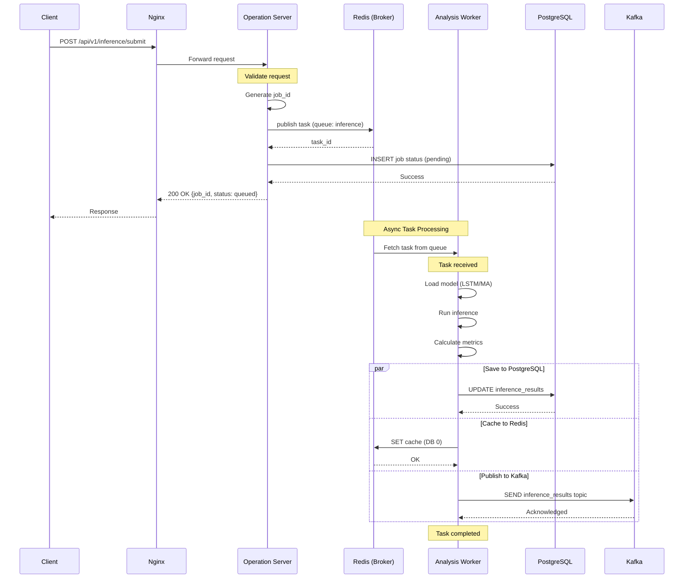

### 1.2 대시보드 실시간 업데이트 시퀀스

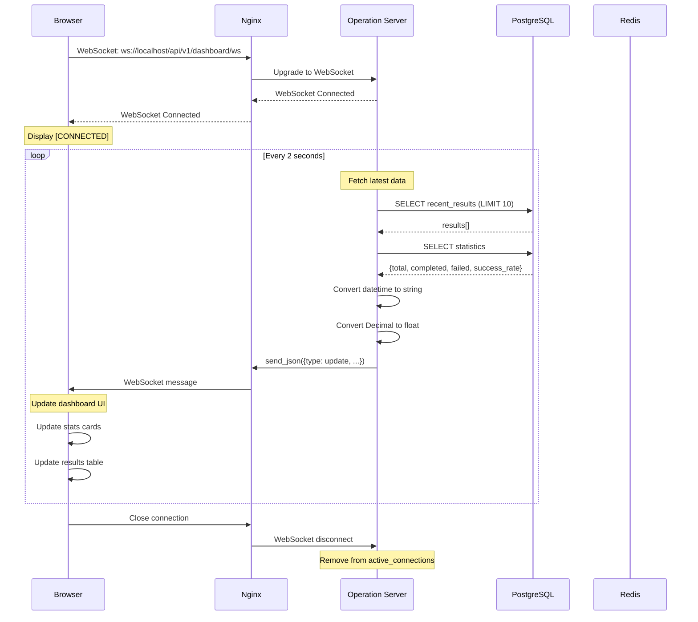

### 1.3 데이터 시뮬레이터 플로우

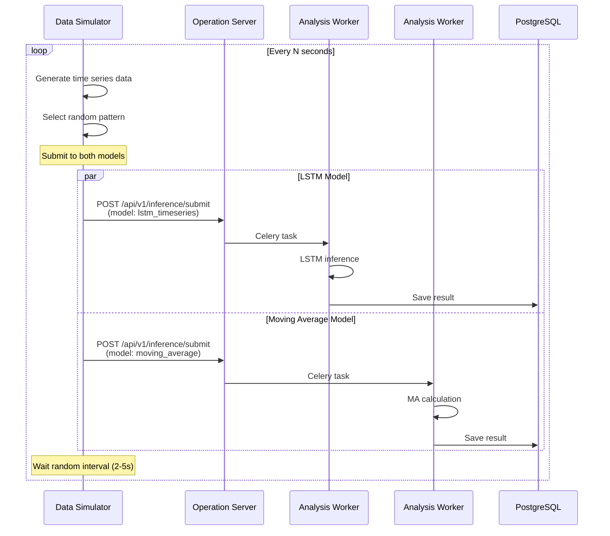

## 2. 클래스 다이어그램

### 2.1 Operation Server 클래스 구조

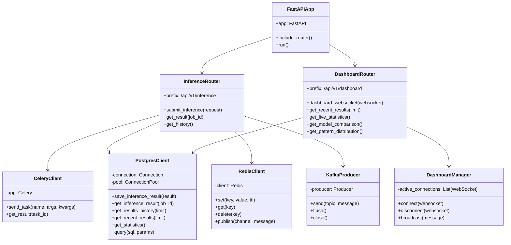

### 2.2 Analysis Worker 클래스 구조

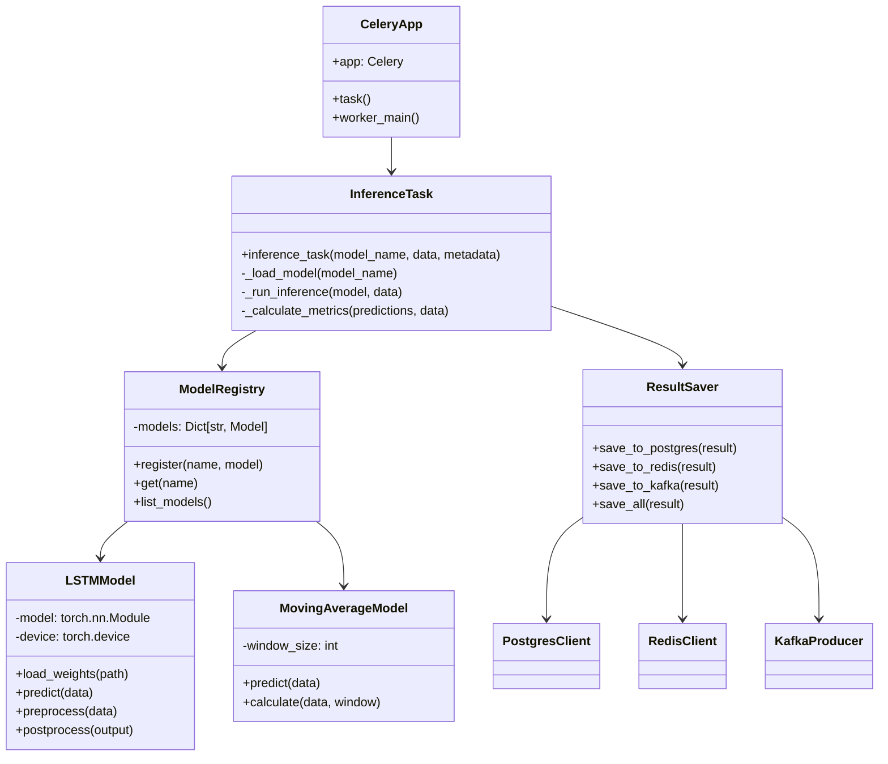

### 2.3 데이터 모델 클래스

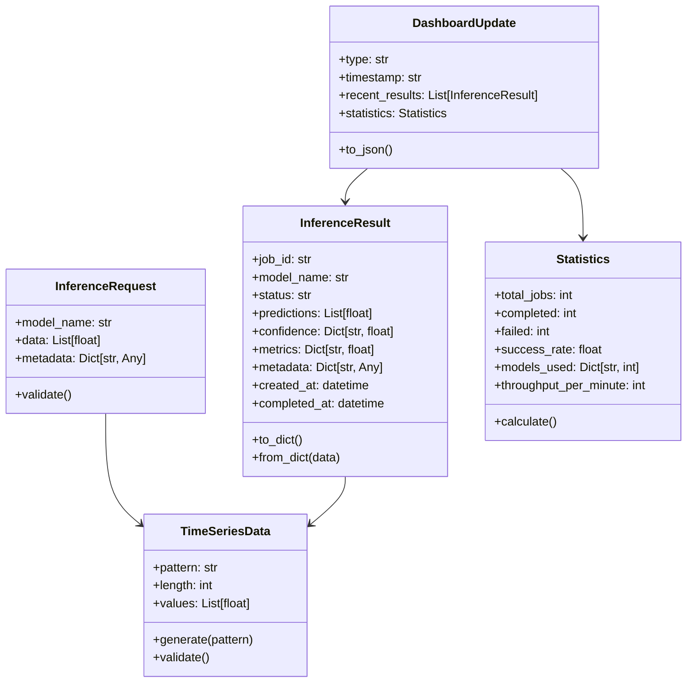

## 3. 컴포넌트 다이어그램

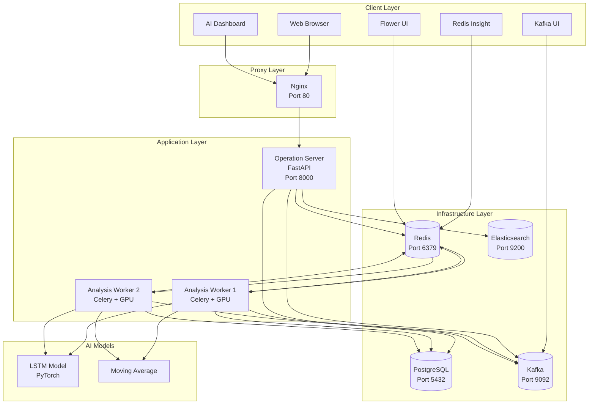

## 4. 상태 다이어그램

### 4.1 추론 작업 상태 전이

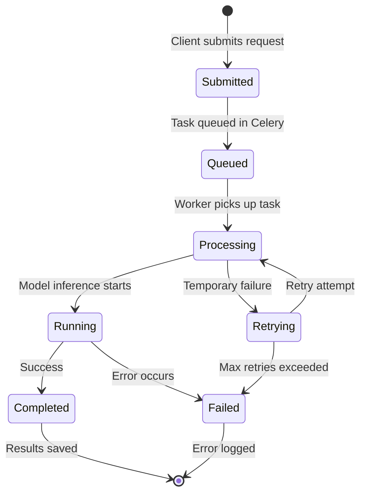

### 4.2 WebSocket 연결 상태

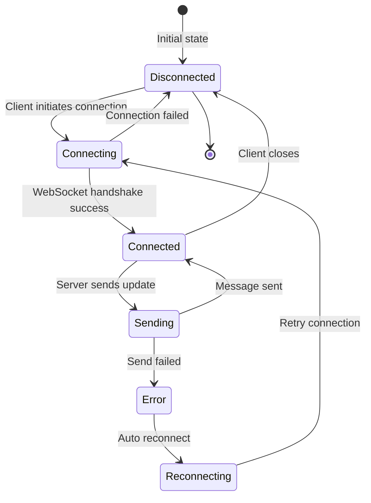

## 5. 배포 다이어그램

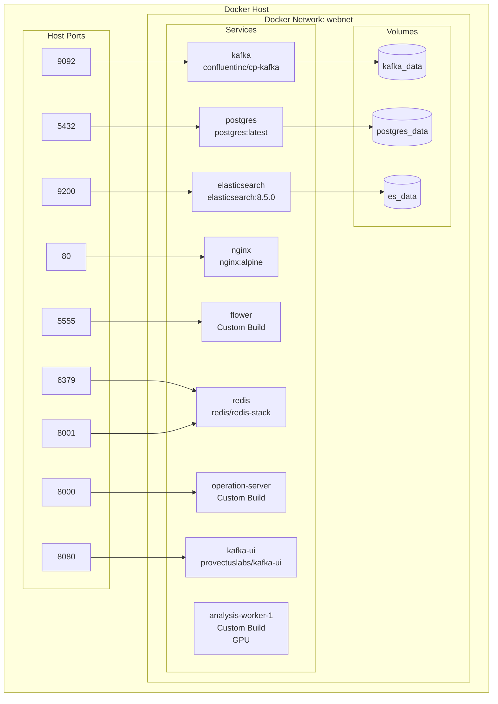

## 6. 활동 다이어그램

### 6.1 데이터 처리 파이프라인

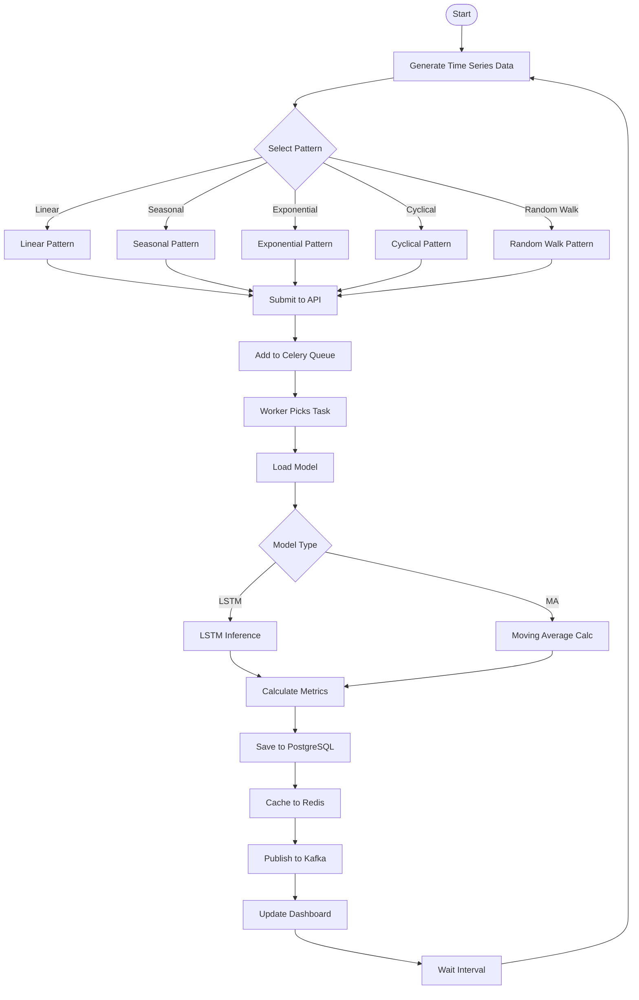

## 다이어그램 사용 방법

이 문서의 다이어그램들은 Mermaid 문법을 사용합니다. 다음 도구들을 통해 시각화할 수 있습니다:

1. **GitHub**: GitHub에서 자동으로 렌더링
2. **VS Code**: Mermaid Preview 확장 설치
3. **Online**: https://mermaid.live/
4. **Markdown Viewers**: 대부분의 모던 마크다운 뷰어 지원

## 다이어그램 업데이트

시스템 구조 변경 시 해당 다이어그램을 함께 업데이트해야 합니다:
- 새로운 서비스 추가
- API 엔드포인트 변경
- 데이터 플로우 수정
- 상태 전이 변경
